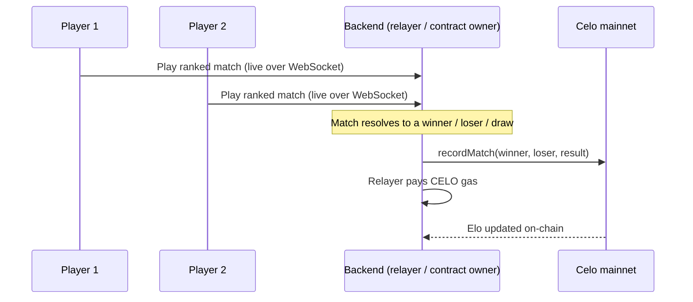

# Gasless Ranking

MindDuel players **never sign a transaction and never pay gas**. Ranked results are written to Celo mainnet by a backend relayer, so the entire experience stays "click connect, click play" — no wallet funding, no network switching, no gas.

## How it works

The `MindDuelRanking` contract has an owner, and that owner is a backend **relayer** wallet. When a ranked match finishes, the backend calls `recordMatch()` on the contract and pays the CELO gas itself. Players are never in the signing path.

The relayer signs and pays for the on-chain ranking update. Players only connect a wallet to identify themselves — they do not approve, sign, or fund anything to have a ranked result recorded.

## Why a relayer

Reading on-chain Elo is free, but writing it costs gas. Routing every ranked result through the owner-relayer means:

- **Zero friction for players.** No "fund a wallet first," no gas prompts mid-match.
- **One trusted writer.** Only the contract owner can call `recordMatch()`, so results cannot be forged by arbitrary callers.
- **Consistent settlement.** The backend records the result the moment a match resolves, keeping the on-chain ladder in sync with play.

## What gasless ranking does NOT do

- It does **not** wager anything. Ranked matches are a pure skill ladder — win = points up, loss = points down. There is no stake, pot, or payout.
- It does **not** touch player funds. The relayer only spends its own CELO on gas to record results.

## Why this matters

A new player landing on a Web3 game and being told "fund a wallet, switch networks, approve a transaction, wait, retry" is the single biggest drop-off point in consumer crypto. Gasless ranking removes that wall entirely: players compete on a real on-chain Elo ladder on Celo mainnet without ever opening a gas dialog.

For the contract details, see [Smart Contracts](../technical/smart-contracts.md). For the API schema, see [Backend API](../technical/backend-api.md).
