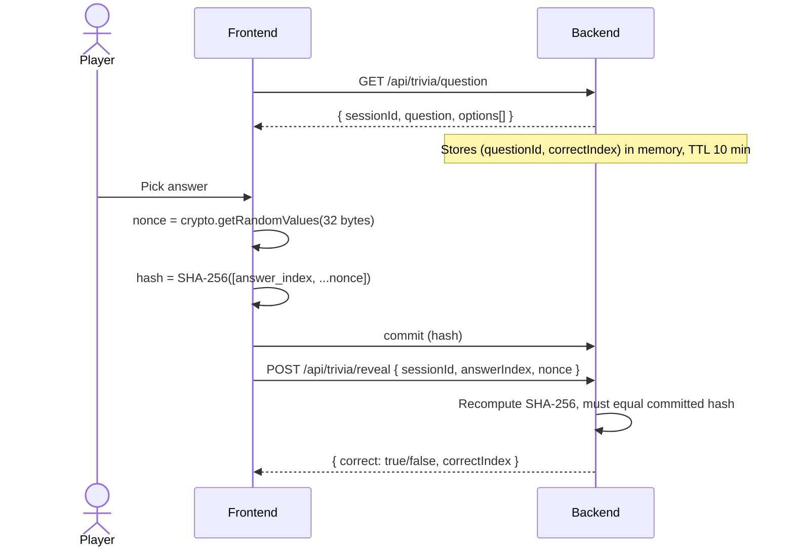

# Trivia Engine

The trivia engine is the gate that turns Tic Tac Toe into a real skill game. Every move requires a correct answer.

## The question bank

Questions are served by a stateless Fastify backend at `GET /api/trivia/question`. They come from a curated bank in `backend/src/data/questions.ts`.

### Categories

| Category | Coverage |
|---|---|
| **General Knowledge** | Broad trivia across topics |
| **Crypto & Web3** | Blockchain, DeFi, NFTs, Celo ecosystem |
| **Science** | Physics, biology, chemistry |
| **History** | World history, major events |
| **Math** | Arithmetic, algebra, logic puzzles |
| **Pop Culture** | Movies, music, internet culture |

Players can filter by one or more categories via query params: `?categories=Crypto+%26+Web3,Science`. If fewer than 3 questions match the filter, the server falls back to the full bank so the game never deadlocks.

### Difficulty tiers

| Tier | Client-side time limit |
|---|---|
| Easy | 30 seconds |
| Medium | 20 seconds |
| Hard | 15 seconds |

The timer is a UX cue that drives the live turn flow. In Blitz mode the answer window tightens to 5 seconds.

## Commit-reveal flow

The whole point of the trivia engine is that **the backend never leaks the answer to the opposing player**, and answers are verified against a commitment the player made before seeing the result.

The commit-reveal step uses a SHA-256 hash so a player cannot change their answer after committing. The backend recomputes the hash on reveal: whatever you reveal must hash to what you committed.

### Wrong-answer convention

If the reveal resolves to `correct: false`, it is treated as an explicit miss:

- The hash still has to verify (so you cannot fake a wrong-answer reveal without having committed).
- No piece is placed.
- Turn switches to opponent.

This keeps the turn flow clean even after a miss.

## Session lifecycle

| Step | TTL / Limit |
|---|---|
| Session created on `GET /api/trivia/question` | 10 minutes |
| Session invalidated on first `POST /api/trivia/reveal` | One-shot |
| Hint peeks (`/api/trivia/peek`) | Up to 3 free hints per match |

Sessions are kept in-memory. If the backend restarts mid-match, players start a new session on the next turn.

## Live sync

Matches are synchronized in real time over **WebSocket**. Both players see board state, turn changes, and reveal results live as they happen — there is no polling delay between moves.

## API surface

| Endpoint | Purpose |
|---|---|
| `GET /api/trivia/question` | Fetch a random question (no correct index) and create a session |
| `POST /api/trivia/reveal` | Reveal whether the player's answer was correct |
| `GET /api/trivia/peek` | Free-hint partial reveal (`eliminate2`, `first-letter`) |
| `GET /api/trivia/categories` | List categories with question counts |
| `GET /api/trivia/stats` | Question bank statistics by category and difficulty |

See [Backend API](../technical/backend-api.md) for full request/response schemas.

## Why this matters

The commit-reveal design means a player locks in their answer before learning whether it was right, and the answer is verified against that commitment rather than being changeable after the fact. The server serves questions and confirms results to the player's UI; the SHA-256 commitment keeps the answer honest.

That is the difference between "trivia gate you can game" and "trivia gate that actually tests you."
