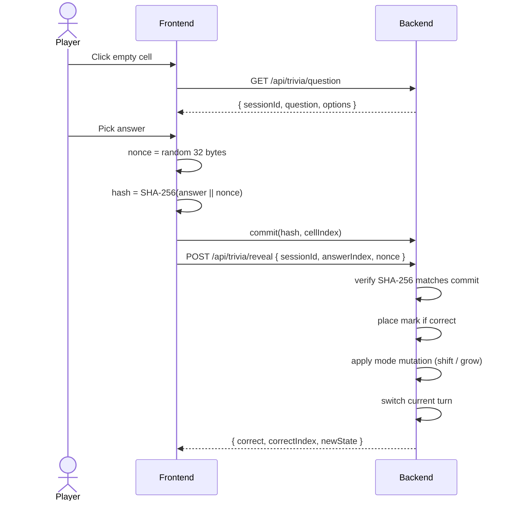

# How It Works

A complete MindDuel match has three phases: **match up**, **play**, **rank**. Here is what happens at each step, end to end.

## 1. Match up

### Player one creates a match

Player one picks a mode (**Classic**, **Shifting Board**, **Scale Up**, **Blitz**, or **vs-AI** practice) and whether the match is **Ranked** or **Casual**. The frontend exposes this as **Create Match** and generates a `MNDL-XXXXXX` join code. There is nothing to stake — players just connect a wallet and play.

### Player two joins

Player two either takes a slot from matchmaking (**Quick Match**) or pastes the `MNDL-XXXXXX` join code into **Join Game**. Once both players are in, the match goes active and player one moves first.

> Only **Ranked** PvP matches are recorded on-chain. **Casual** and **vs-AI** are just for fun and never touch the ranking contract.

## 2. Play (one turn at a time)

Key things that happen on reveal:

1. Recompute `SHA-256(answer || nonce)` and require it equals the committed hash.
2. Discard the commitment immediately (kills replay attacks).
3. If the answer was correct: place `X` or `O` at the committed cell.
4. Apply mode mutation:
   - **Shifting Board:** every few rounds, rotate the board.
   - **Scale Up:** grow from 3x3 to 4x4, then to 5x5 as correct answers accumulate.
5. Switch the current turn and advance the round.

If the answer was wrong, the turn simply passes — the commit still has to verify, but no piece is placed.

You can also spend up to **3 free hints** per match to help with a hard question. Hints are free; there is no paid hint economy. See [Free Hints](../features/hint-economy.md).

## 3. Rank

A game ends when someone gets three in a row, the board fills with no winner (draw), or a turn times out. When a **Ranked** PvP match ends, the result is recorded on-chain:

1. The backend identifies the winner and loser (or a draw).
2. The **relayer** (the contract owner) calls `recordMatch(winner, loser, draw, matchId)` and pays the CELO gas.
3. The contract updates both players' points using zero-sum Elo (K=32, start 1000, floored at 0), bumps their W/L/D, and recomputes their rank tier.
4. The call is idempotent per `matchId`, so the same result is never counted twice.

Players never sign anything and never pay gas. **Casual** and **vs-AI** matches skip this step entirely.

| Outcome | Effect on rank |
|---|---|
| Win (Ranked) | Winner's points rise, loser's fall by the same amount. |
| Draw (Ranked) | Both players' points move toward each other. |
| Casual / vs-AI | No change — nothing is recorded. |

## What is happening off-chain

The backend handles the live game and everything that does not need to be on-chain:

- Serves trivia questions (the question text is never written on-chain).
- Generates `sessionId` and stores `(questionId, correctIndex)` briefly to verify reveals.
- Runs the board, turn order, mode mutations, and win/draw detection.
- Mirrors finished match results into Postgres for the leaderboard and history pages.
- Relays WebSocket messages between clients in the same room.
- Runs the relayer that submits ranked results on-chain and pays the gas (see [Gasless Ranking](../features/sponsored-gas.md)).

The on-chain ranking contract is the single source of truth for the competitive ladder. Anyone can read it directly with `getPlayer`, `playerCount`, and the paginated `getPlayers`.

For a deeper dive into the contract, see [Smart Contracts](../technical/smart-contracts.md). For the full system map, see [Architecture](../technical/architecture.md).
