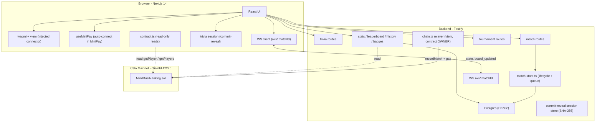
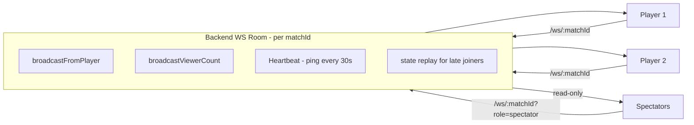

# Architecture

MindDuel is a three-workspace system with sharply separated responsibilities. Ranked results are settled on Celo by a trusted relayer, while gameplay and matchmaking run off-chain for speed. There is **no staking or betting** — ranked play is a pure skill ladder backed by on-chain points.

| Workspace | Responsibility |
|---|---|
| **`contracts/` — Foundry / Solidity** | On-chain points & ranking ledger (`MindDuelRanking.sol`). Idempotent record of every ranked match. Source of truth for the leaderboard. |
| **`backend/` — Fastify (Node/TS)** | Trivia question server, match lifecycle + matchmaking, WebSocket relay, and the **relayer** that owns the contract and submits results (paying CELO gas). |
| **`frontend/` — Next.js 14** | Wallet connection (wagmi + viem), live game UI, real-time board sync. **Reads** the contract for points/rank; never sends transactions. |

Players never sign a transaction or pay gas. They connect a wallet (MiniPay or any injected wallet) and play; the relayer records the ranked outcome.

## System map



## One full ranked match — data flow

```mermaid
sequenceDiagram
    actor Player
    participant UI as Frontend
    participant BE as Backend
    participant Chain as Celo

    Player->>UI: Connect wallet (MiniPay / injected)
    Player->>UI: Select cell, request question
    UI->>BE: GET /api/trivia/question
    BE-->>UI: { sessionId, question, options }

    Player->>UI: Submit answer
    UI->>BE: POST /api/trivia/reveal
    BE->>BE: SHA-256 commit-reveal check
    BE-->>UI: { correct, correctIndex }

    UI->>WSC: board_updated (relayed to opponent)
    Note over UI,BE: Repeat until win / draw / board full

    UI->>BE: POST /api/match/finish { matchId, winner, ranked }
    BE->>Chain: recordMatch(winner, loser, draw, keccak256(matchId))
    Chain->>Chain: idempotent (settled[matchId]); apply Elo
    Chain-->>BE: MatchRecorded event + tx receipt
    BE-->>UI: { winnerDelta, loserDelta, winnerPoints, loserPoints, txHash, earnedBadges }
    UI->>Chain: read getPlayer for updated rank
```

## Frontend (Next.js 14)

Key dependencies:

| Package | Use |
|---|---|
| `next` 14 | App Router |
| `wagmi` | React hooks for wallet + contract reads |
| `viem` | Celo client, ABI encoding, contract reads |
| `@tanstack/react-query` | Async cache for on-chain reads |
| `framer-motion` | Animations (board shift, transitions) |
| `tailwindcss` | Styling |

### Wallet & contract access

| File | Purpose |
|---|---|
| `frontend/src/lib/wagmi.ts` | wagmi config for Celo; single `injected` connector covers MiniPay and desktop wallets |
| `frontend/src/hooks/useMiniPay.ts` | Detects MiniPay and auto-connects the injected wallet |
| `frontend/src/lib/contract.ts` | Read-only `MindDuelRanking` access (`getPlayer`, `playerCount`, `getPlayers`) for profiles and the leaderboard |
| `frontend/src/lib/api.ts` | Typed calls to the Fastify backend |

The frontend only **reads** the contract. All ranked writes happen server-side via the relayer.

### Pages

```
/                      Landing
/lobby                 Create / join / queue
/game/[matchId]        Live game room
/result                Match result screen
/leaderboard           On-chain rankings
/history               Player match history
/tournaments           List of brackets
/tournaments/[id]      Bracket view
/spectate/[matchId]    Read-only spectator mode
/profile               Wallet profile + badges
```

## Backend (Fastify)

Single Node process. Stateless except for the in-memory commit-reveal session store, the matchmaking queue, and the WebSocket room map.

```
backend/src/
  index.ts                      Bootstrap, CORS, plugins
  routes/
    trivia.ts                   Trivia question + reveal + peek
    match.ts                    Create / join / queue / state / finish / vsai
    stats.ts                    Leaderboard / history / badges / stats
    tournament.ts               Bracket lifecycle
    ws.ts                       /ws/:matchId rooms
  lib/
    chain.ts                    Celo relayer (viem) — contract OWNER, recordMatch
    match-store.ts              Match CRUD + matchmaking queue
    db.ts, schema.ts            Drizzle ORM + Postgres
    commit-reveal.ts            In-memory SHA-256 session store
    badges.ts                   Badge metadata + award logic
    tournament-store.ts         Tournament + bracket state
  data/
    questions.ts                Curated trivia bank (categories + difficulties)
```

### The relayer (`backend/src/lib/chain.ts`)

The backend holds the contract **owner** key and is the only party that can write ranked results:

- Built on `viem` with the `celo` chain and `https://forno.celo.org` RPC.
- `recordMatchOnChain()` simulates then submits `recordMatch(winner, loser, draw, matchId)` and pays CELO gas.
- `matchId` strings are hashed with `keccak256` into the `bytes32` the contract expects.
- Idempotent: a retried submission hits the contract's `AlreadySettled` guard, and the relayer simply reads current points instead of double-counting.
- If the contract address / relayer key are unset (local dev), the helpers degrade gracefully and the app runs DB-only with no on-chain settlement.

## Smart contract (`contracts/`)

A single Foundry/Solidity workspace:

```
contracts/
  src/MindDuelRanking.sol       On-chain points & ranking ledger
  test/                         Foundry tests
  script/Deploy.s.sol           forge script deploy to Celo
```

Built with solc 0.8.24 and run via WSL. The contract stores a per-player Elo rating and exposes paginated reads for building the leaderboard. See [Smart Contracts](./smart-contracts.md) for the full schema.

## Real-time WebSocket layout



The last board update is cached per room and replayed to late-joining clients. Spectator outbound messages are silently dropped.

For the WebSocket protocol, see [Real-time Sync](./realtime-sync.md). For the contract schema and rating math, see [Smart Contracts](./smart-contracts.md).
